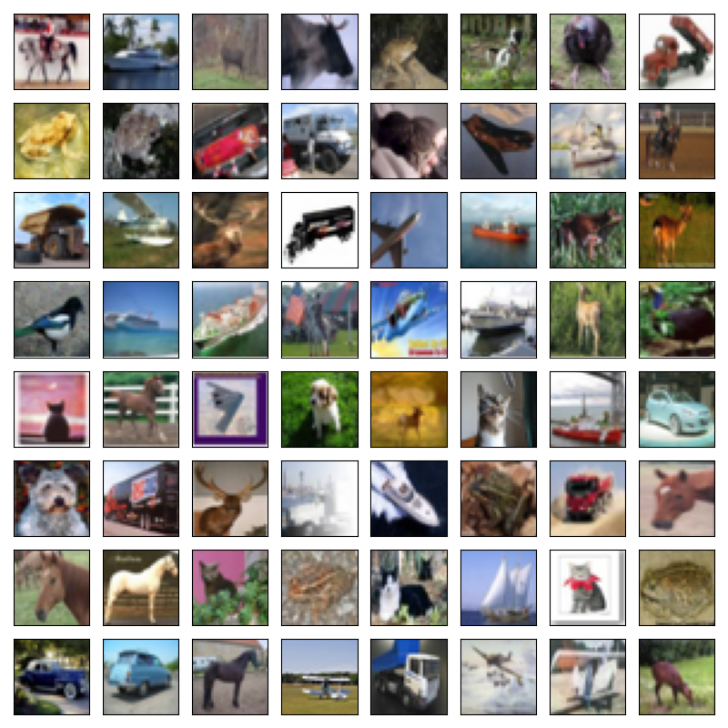
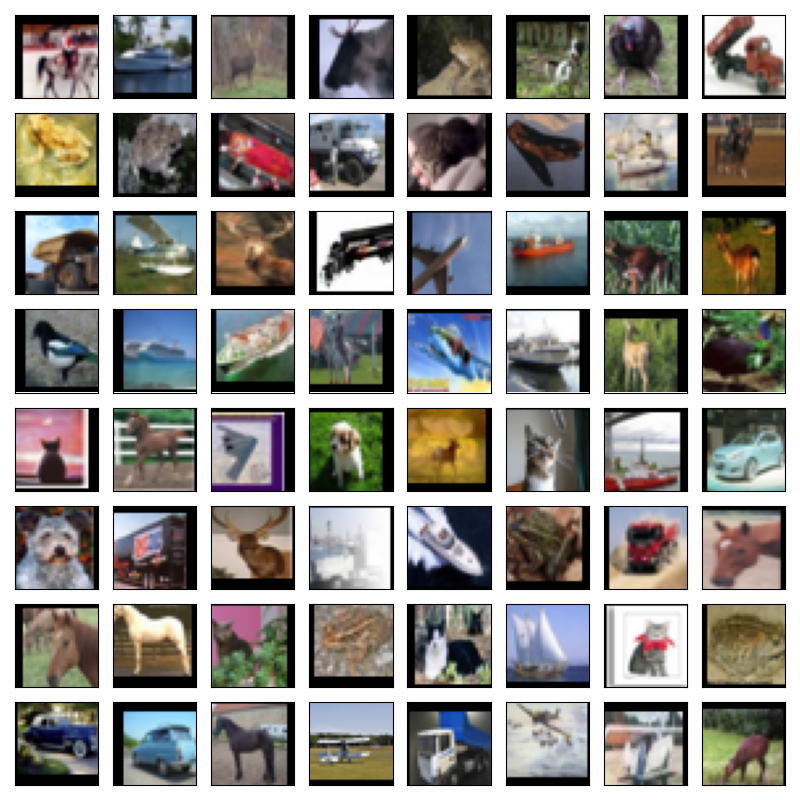
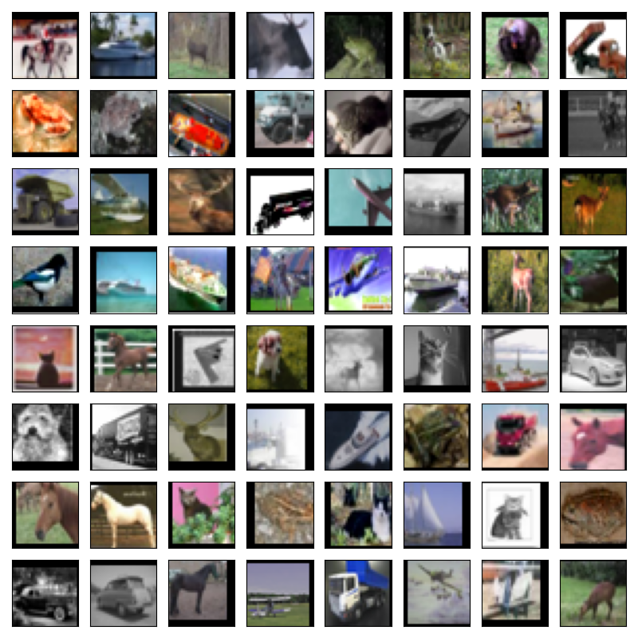

# CIFAR

This project aims to conduct a comprehensive evaluation of various optimization and sampling methods using residual networks on the CIFAR-10 and CIFAR-100 datasets ([Krizhevsky, 2009](https://www.cs.toronto.edu/~kriz/cifar.html)).
Specifically, we followed the experimental setup detailed in [Izmailov et al. (2021)](https://arxiv.org/abs/2104.14421), where the HMC samples were publicly available from the same study.
1. Utilizing the ResNet-20-FRN-Swish architecture, which is a residual network with 20 layers featuring projection shortcuts and filter response normalization ([He et al., 2016](https://arxiv.org/abs/1512.03385); [Singh and Krishnan, 2020](https://arxiv.org/abs/1911.09737)).
2. Training on 40,960 examples and validating on 9,040 examples.

## CIFAR-10

### Optimization methods

### Sampling methods

```
Notation: Mean (Median) ± Std [Min - Max], based on 8 trials (except hmc).

+--------------+--------------+------------------+----------------------------------+----------------------------------+----------------------------------+-----------+
| Augmentation | Schedule     | Method           | val/ens_err                      | val/ens_nll                      | val/ens_amb                      | # Samples |
+--------------+--------------+------------------+----------------------------------+----------------------------------+----------------------------------+-----------+
| none         | -            | hmc              | .101 (.101) ± .002 [.099 - .102] | .309 (.308) ± .002 [.308 - .311] | .484 (.484) ± .008 [.476 - .492] | 240       |
| none         | -            | hmc              | .092                             | .295                             | .526                             | 240 * 3   |
+--------------+--------------+------------------+----------------------------------+----------------------------------+----------------------------------+-----------+
| none         | cyclical     | sgld             | .153 (.153) ± .004 [.148 - .158] | .473 (.471) ± .011 [.456 - .488] | .182 (.183) ± .007 [.171 - .192] | 100       |
| none         | cyclical     | msgld            | 
| none         | cyclical     | asgld            | 
| none         | cyclical     | sghmc            | 
| none         | cyclical     | sgnht            | 
+--------------+--------------+------------------+----------------------------------+----------------------------------+----------------------------------+-----------+
```

## CIFAR-100

### Optimization methods

### Sampling methods

```
Notation: Mean (Median) ± Std [Min - Max], based on 8 trials (except hmc).

+--------------+--------------+------------------+----------------------------------+----------------------------------+----------------------------------+-----------+
| Augmentation | Schedule     | Method           | val/ens_err                      | val/ens_nll                      | val/ens_amb                      | # Samples |
+--------------+--------------+------------------+----------------------------------+----------------------------------+----------------------------------+-----------+
| none         | -            | hmc              | .350 (.350) ± .006 [.344 - .357] | 1.28 (1.28) ± .013 [1.26 - 1.29] | .836 (.830) ± .013 [.827 - .851] | 150       |
| none         | -            | hmc              | .329                             | 1.22                             | .949                             | 150 * 3   |
+--------------+--------------+------------------+----------------------------------+----------------------------------+----------------------------------+-----------+
| none         | cyclical     | sgld             | .412 (.411) ± .005 [.406 - .421] | 1.56 (1.56) ± .020 [1.54 - 1.59] | .447 (.448) ± .009 [.432 - .459] | 100       |
| none         | cyclical     | msgld            | 
| none         | cyclical     | asgld            | 
| none         | cyclical     | sghmc            | 
| none         | cyclical     | sgnht            | 
+--------------+--------------+------------------+----------------------------------+----------------------------------+----------------------------------+-----------+
```

# CIFAR (deprecated)

> [!WARNING]
> The following results use standard normal initialization (not He normal) and are therefore deprecated.

## CIFAR-10

### Optimization methods

```
Notation: Mean (Median) ± Std [Min - Max], based on 10 trials.

+--------------+--------------+------------------+----------------------------------+----------------------------------+
| Augmentation | Schedule     | Method           | val/err                          | val/nll                          |
+--------------+--------------+------------------+----------------------------------+----------------------------------+
| none         | cosine       | sgd              | .181 (.180) ± .006 [.172 - .191] | .767 (.765) ± .048 [.698 - .843] |
| none         | cosine       | sgdw             | .180 (.181) ± .005 [.169 - .187] | .758 (.763) ± .042 [.696 - .836] |
| none         | cosine       | msgd-momentum    | .177 (.186) ± .017 [.155 - .195] | .769 (.795) ± .073 [.663 - .867] |
| none         | cosine       | msgd-nesterov    | .170 (.175) ± .012 [.150 - .184] | .742 (.755) ± .061 [.640 - .819] |
| none         | cosine       | adam             | .198 (.197) ± .004 [.192 - .206] | .808 (.810) ± .025 [.770 - .841] |
| none         | cosine       | adamw            | .143 (.142) ± .008 [.134 - .164] | .554 (.556) ± .023 [.524 - .603] |
| none         | cosine       | ivon             | .139 (.139) ± .003 [.133 - .144] | .462 (.465) ± .017 [.434 - .485] |
+--------------+--------------+------------------+----------------------------------+----------------------------------+
| simple       | cosine       | msgd-momentum    | .101 (.100) ± .006 [.092 - .111] | .386 (.392) ± .020 [.349 - .415] |
| simple       | cosine       | msgd-nesterov    | .098 (.097) ± .004 [.093 - .108] | .384 (.379) ± .019 [.364 - .421] |
| simple       | cosine       | adamw            | .092 (.093) ± .002 [.088 - .095] | .347 (.350) ± .007 [.333 - .356] |
| simple       | cosine       | ivon             | .105 (.106) ± .003 [.101 - .111] | .332 (.335) ± .009 [.314 - .342] |
+--------------+--------------+------------------+----------------------------------+----------------------------------+
| colour       | cosine       | msgd-momentum    | .099 (.098) ± .003 [.095 - .104] | .349 (.350) ± .011 [.332 - .367] |
| colour       | cosine       | msgd-nesterov    | .097 (.096) ± .005 [.092 - .109] | .345 (.343) ± .009 [.335 - .364] |
| colour       | cosine       | adamw            | .092 (.092) ± .001 [.089 - .094] | .326 (.326) ± .005 [.317 - .333] |
| colour       | cosine       | ivon             | .105 (.105) ± .005 [.097 - .112] | .324 (.324) ± .012 [.300 - .340] |
+--------------+--------------+------------------+----------------------------------+----------------------------------+
```

### Sampling methods

```
Notation: Mean (Median) ± Std [Min - Max], based on 10 trials (except hmc).

+--------------+--------------+------------------+----------------------------------+----------------------------------+----------------------------------+-----------+
| Augmentation | Schedule     | Method           | val/ens_err                      | val/ens_nll                      | val/ens_amb                      | # Samples |
+--------------+--------------+------------------+----------------------------------+----------------------------------+----------------------------------+-----------+
| none         | -            | hmc              | .101 (.101) ± .002 [.099 - .102] | .309 (.308) ± .002 [.308 - .311] | .484 (.484) ± .008 [.476 - .492] | 240       |
| none         | -            | hmc              | .092                             | .295                             | .526                             | 240 * 3   |
+--------------+--------------+------------------+----------------------------------+----------------------------------+----------------------------------+-----------+
| none         | constant     | sgld             | .142 (.142) ± .002 [.139 - .145] | .475 (.472) ± .008 [.466 - .490] | .236 (.237) ± .010 [.218 - .247] | 100       |
| none         | constant     | msgld            | .116 (.117) ± .003 [.111 - .120] | .393 (.393) ± .013 [.370 - .411] | .307 (.306) ± .019 [.280 - .340] | 100       |
| none         | constant     | asgld            | .141 (.140) ± .003 [.138 - .147] | .474 (.475) ± .007 [.461 - .486] | .236 (.234) ± .008 [.224 - .251] | 100       |
| none         | constant     | sghmc            | .135 (.135) ± .002 [.132 - .139] | .444 (.444) ± .002 [.442 - .448] | .206 (.206) ± .003 [.201 - .209] | 100       |
| none         | constant     | sgnht            | .133 (.132) ± .002 [.130 - .137] | .438 (.439) ± .003 [.430 - .442] | .207 (.208) ± .004 [.197 - .211] | 100       |
| none         | constant     | adam_sgld        | .136 (.138) ± .004 [.131 - .139] | .445 (.448) ± .009 [.432 - .453] | .198 (.198) ± .004 [.195 - .202] | 100       |
+--------------+--------------+------------------+----------------------------------+----------------------------------+----------------------------------+-----------+
| none         | cyclical     | sgld             | .148 (.150) ± .004 [.142 - .152] | .467 (.465) ± .012 [.453 - .492] | .189 (.191) ± .007 [.179 - .200] | 100       |
| none         | cyclical     | msgld            | .128 (.129) ± .003 [.121 - .132] | .406 (.407) ± .013 [.388 - .431] | .254 (.262) ± .020 [.228 - .289] | 100       |
| none         | cyclical     | asgld            | .150 (.150) ± .002 [.147 - .154] | .479 (.478) ± .008 [.467 - .493] | .175 (.175) ± .004 [.168 - .181] | 100       |
| none         | cyclical     | sghmc            | .135 (.135) ± .002 [.132 - .139] | .432 (.431) ± .005 [.424 - .441] | .166 (.166) ± .005 [.159 - .175] | 100       |
| none         | cyclical     | sgnht            | .136 (.136) ± .003 [.132 - .140] | .430 (.430) ± .005 [.422 - .438] | .179 (.179) ± .006 [.170 - .188] | 100       |
+--------------+--------------+------------------+----------------------------------+----------------------------------+----------------------------------+-----------+
```

## CIFAR-100

### Optimization methods

```
Notation: Mean (Median) ± Std [Min - Max], based on 10 trials.

+--------------+--------------+------------------+----------------------------------+----------------------------------+
| Augmentation | Schedule     | Method           | val/err                          | val/nll                          |
+--------------+--------------+------------------+----------------------------------+----------------------------------+
| none         | cosine       | sgd              | .655 (.655) ± .016 [.634 - .679] | 3.01 (2.95) ± .158 [2.83 - 3.33] |
| none         | cosine       | sgdw             | .667 (.660) ± .019 [.643 - .703] | 3.19 (3.16) ± .207 [2.91 - 3.54] |
| none         | cosine       | msgd-momentum    | .611 (.612) ± .013 [.590 - .628] | 2.75 (2.75) ± .109 [2.61 - 2.92] |
| none         | cosine       | msgd-nesterov    | .610 (.606) ± .021 [.584 - .644] | 2.77 (2.68) ± .208 [2.56 - 3.13] |
| none         | cosine       | adamw            | .549 (.551) ± .004 [.543 - .558] | 2.27 (2.27) ± .025 [2.22 - 2.30] |
| none         | cosine       | ivon             | .449 (.450) ± .008 [.439 - .463] | 1.68 (1.69) ± .042 [1.61 - 1.73] |
+--------------+--------------+------------------+----------------------------------+----------------------------------+
| simple       | cosine       | msgd-momentum    | .395 (.393) ± .007 [.387 - .407] | 1.49 (1.48) ± .037 [1.43 - 1.54] |
| simple       | cosine       | msgd-nesterov    | .392 (.393) ± .005 [.382 - .398] | 1.50 (1.51) ± .029 [1.43 - 1.53] |
| simple       | cosine       | adamw            | .385 (.384) ± .005 [.378 - .395] | 1.48 (1.48) ± .022 [1.44 - 1.51] |
| simple       | cosine       | ivon             | .390 (.392) ± .008 [.375 - .401] | 1.47 (1.48) ± .034 [1.42 - 1.53] |
+--------------+--------------+------------------+----------------------------------+----------------------------------+
| colour       | cosine       | msgd-momentum    | .378 (.378) ± .007 [.371 - .389] | 1.37 (1.37) ± .016 [1.35 - 1.41] |
| colour       | cosine       | msgd-nesterov    | .371 (.372) ± .003 [.365 - .374] | 1.35 (1.35) ± .011 [1.34 - 1.37] |
| colour       | cosine       | adamw            | .364 (.363) ± .003 [.360 - .371] | 1.33 (1.33) ± .015 [1.32 - 1.36] |
| colour       | cosine       | ivon             | .381 (.382) ± .006 [.372 - .387] | 1.39 (1.39) ± .018 [1.35 - 1.41] |
+--------------+--------------+------------------+----------------------------------+----------------------------------+
```

### Sampling methods

```
Notation: Mean (Median) ± Std [Min - Max], based on 10 trials (except hmc).

+--------------+--------------+------------------+----------------------------------+----------------------------------+----------------------------------+-----------+
| Augmentation | Schedule     | Method           | val/ens_err                      | val/ens_nll                      | val/ens_amb                      | # Samples |
+--------------+--------------+------------------+----------------------------------+----------------------------------+----------------------------------+-----------+
| none         | -            | hmc              | .350 (.350) ± .006 [.344 - .357] | 1.28 (1.28) ± .013 [1.26 - 1.29] | .836 (.830) ± .013 [.827 - .851] | 150       |
| none         | -            | hmc              | .329                             | 1.22                             | .949                             | 150 * 3   |
+--------------+--------------+------------------+----------------------------------+----------------------------------+----------------------------------+-----------+
| none         | constant     | sgld             | .399 (.399) ± .003 [.393 - .403] | 1.57 (1.56) ± .007 [1.56 - 1.58] | .583 (.583) ± .010 [.568 - .600] | 100       |
| none         | constant     | msgld            | .355 (.355) ± .004 [.345 - .360] | 1.38 (1.38) ± .013 [1.36 - 1.40] | .825 (.822) ± .014 [.811 - .857] | 100       |
| none         | constant     | sghmc            | .395 (.395) ± .004 [.391 - .404] | 1.52 (1.51) ± .009 [1.50 - 1.53] | .541 (.543) ± .009 [.528 - .555] | 100       |
| none         | constant     | sgnht            | .388 (.387) ± .003 [.383 - .391] | 1.51 (1.51) ± .008 [1.49 - 1.52] | .544 (.546) ± .011 [.526 - .559] | 100       |
+--------------+--------------+------------------+----------------------------------+----------------------------------+----------------------------------+-----------+
| none         | cyclical     | sgld             | .416 (.415) ± .003 [.412 - .422] | 1.59 (1.59) ± .011 [1.57 - 1.62] | .476 (.474) ± .020 [.445 - .507] | 100       |
| none         | cyclical     | sghmc            | .394 (.394) ± .004 [.389 - .401] | 1.54 (1.53) ± .011 [1.53 - 1.56] | .530 (.529) ± .005 [.522 - .539] | 100       |
+--------------+--------------+------------------+----------------------------------+----------------------------------+----------------------------------+-----------+
```

## Appendix

### Augmentations

<details>
  <summary>none (default)</summary>

  
</details>

<details>
  <summary>simple</summary>

  
</details>

<details>
  <summary>colour</summary>

  
</details>
