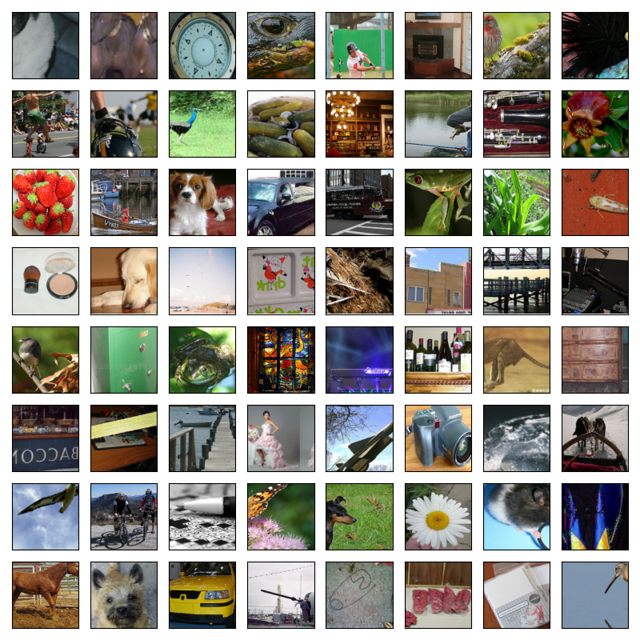
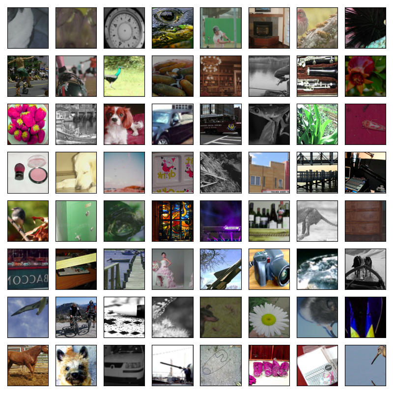

# ImageNet

This project extends the [CIFAR project](../cifar/) to ImageNet using the same procedure. However, since ImageNet requires greater network capacity than CIFAR, we increase the number of convolutional filters in the network by a factor of 8, resulting in the ResNet-20x8-FRN-Swish architecture.

## ImageNet-1k

### Optimization methods

```
Notation: Mean (Median) ± Std [Min - Max], based on 4 trials.

+--------------+--------------+------------------+----------------------------------+----------------------------------+
| Augmentation | Schedule     | Method           | dev/err                          | dev/nll                          |
+--------------+--------------+------------------+----------------------------------+----------------------------------+
| simple       | cyclical     | msgd-momentum    | .245 (.245) ± .004 [.241 - .249] | .957 (.958) ± .012 [.942 - .968] |
| simple       | cyclical     | msgd-nesterov    | .243 (.242) ± .003 [.241 - .248] | .949 (.948) ± .011 [.939 - .960] |
| simple       | cyclical     | ivon             | .276 (.272) ± .009 [.270 - .289] | 1.09 (1.07) ± .045 [1.05 - 1.15] |
+--------------+--------------+------------------+----------------------------------+----------------------------------+
```

### Sampling methods

## Appendix

### Augmentations

<details>
  <summary>simple</summary>

  
</details>

<details>
  <summary>colour</summary>

  
</details>
